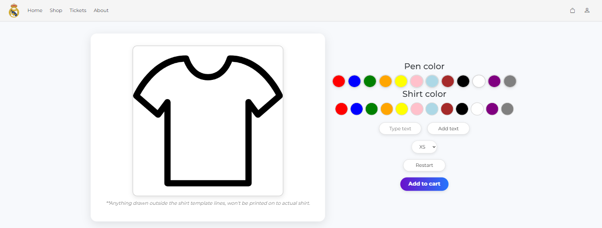
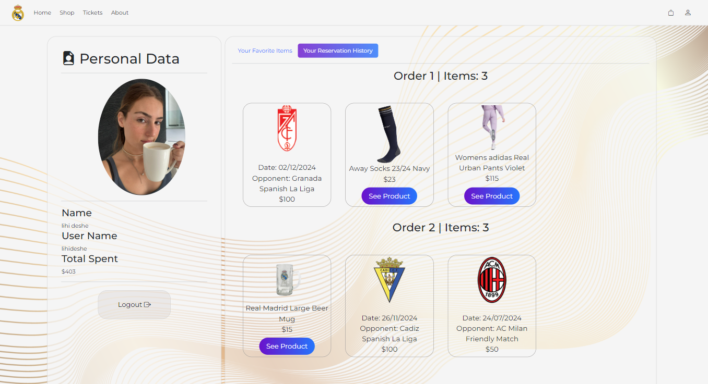

    <h1>Real Madrid Store Project</h1>

Welcome to our Real Madrid store project! This platform was developed as part of our academic coursework, and it combines several modern web technologies to create a fully functional and user-friendly online shopping experience. Our project showcases a store with dynamic data, user authentication, and various management features that are relevant to both customers and administrators.

___

### Table of Contents
- [Features](#features)
- [Application Features](#application-features)
- [Technologies](#technologies)
- [Showcase](#showcase)
- [Authors](#authors)

## Features
The main features of the system include:

- **Product Management**: 
   - Customers can browse through various products, search based on multiple criteria, and filter results to find exactly what they're looking for.
   - Administrators can manage the store's products through an admin panel, including adding new items, updating details, and removing products when necessary.

- **User Authentication & Role Management**:
   - The platform includes a login and registration system where regular users and administrators have different permissions.
   - Users can view and manage their personal order history, while administrators have access to more advanced features like viewing all orders and editing customer data.

- **Shopping Cart & Order History**:
   - Users can easily add items to their shopping cart and proceed to checkout. After placing an order, they can review their order history at any time.

- **Advanced Search & Grouping**:
   - The system supports diverse filter and sorting functionalities, allowing users to search and filter products based on multiple parameters. 
   
- **Real-time API Integration**:
   - To enhance the user experience, we've integrated several real-time APIs:
   - **Weather API**: Users can see current weather updates relevant to their location, adding an interesting interactive element.
   - **Game Score Updates API**: For users who enjoy being updated on the latest Real Madrid games, we provide live updates from popular gaming events and matches.
   - **Facebook API**: New products are automatically uploaded to our Facebook page, keeping our feed updated with the latest items in the store, without manual input. In addition, administrators can upload posts from the admin panel on our website.
   - **Google Maps API**: In the “About” section, we use Google Maps to show the locations of all our store branches. The map dynamically updates with locations pulled from our MongoDB database.
       
- **Data Visualization**:
   - We’ve incorporated **D3.js** to present dynamic graphs. These graphs display real-time data such as a clients per year count and products per category count.
   - The graphs include query capabilities such as **GroupBy** in MongoDB, which helps us group our data.

## Showcase
The platform consists of several key pages that create a seamless user experience:

###Home Page###
The landing page features a call to action button leading to our store, game score updates, slider showcasing our players, and a weather widget providing live updates.

###Product Page###
Each product has its own page with several images, videos, and options to add to the cart.

###Custom T-Shirt###
Using HTML canvas, users can create custom shirts and add to their cart.

###Ticket Page###
The ticket page includes several filtering options and allows users to buy tickets to our games.

###Admin Dashboard###
Accessible only to administrators, this dashboard allows us to manage products, tickets and news, view all orders and users, upload facebook posts and analyze store statistics through our data visualizations.

###Shopping Cart###
Users can view and edit items they’ve added to their cart and proceed to checkout.

###Personal Area###
Logged-in users have access to their personal order history, displaying details of all past purchases, and to their favorite items. 

###About Page###
This page displays our store locations on Google Maps, making it easy for customers to find the nearest branch. In addition, up to date news uploaded by the admin can be visible on a slider in the news section. 

## Technologies
- **Backend**: 
  - Node.js with Express
  - MongoDB for data storage
  - MVC architecture for a clear separation between the logic, data, and presentation layers
- **Frontend**:
  - HTML5 (including Canvas), CSS3, and Bootstrap for responsive design
  - Extensive use of **jQuery** and **AJAX** for smooth, dynamic interactions
- **APIs**:
  - Weather API
  - Game Score Updates API
  - Facebook API (for product feed automation)
  - Google Maps
- **Data Visualization**: 
  - D3.js for dynamic, real-time graphs displaying store statistics

## Authors
 - [Moria Hamami](https://github.com/MoriaHamami)
 - [Lihi Deshe](https://github.com/lihideshe)
 - [Tal Mohaban](https://github.com/Talmohaban)
 - [Noa Moscato](https://github.com/Noamos321)
 - [Ziv Arbel](https://github.com/Zivarbel)

### Conclusion
Our project not only meets the academic requirements but also offers a real-world, practical application for managing an online store. The integration of multiple APIs, advanced search functionality, and user-friendly design ensures a seamless shopping experience for users while providing powerful management tools for store administrators.

We hope you enjoy exploring the project as much as we enjoyed building it!
